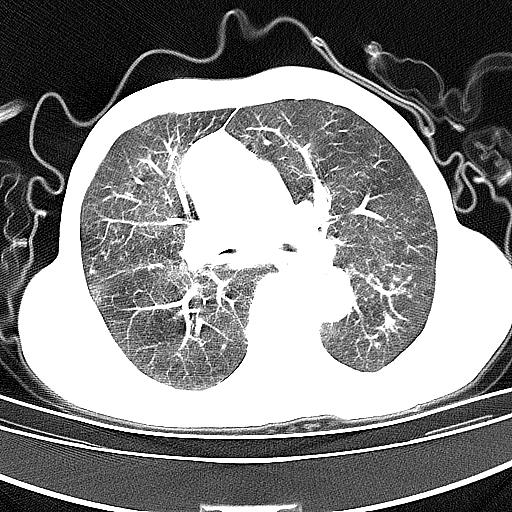
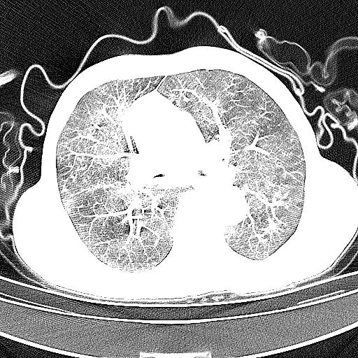
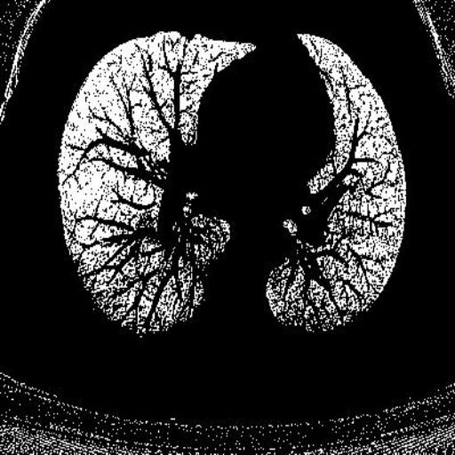
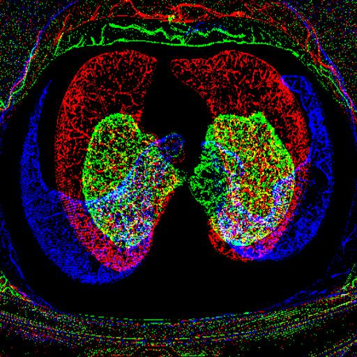

- zh_CN [¼òÌåÖÐÎÄ](Readme/README_CN.md)
- EN [English](Readme/README_EN.md)

# COPD Detection Project

## Project Description

Currently, clinical detection of COPD cases mostly involves persistent airflow limitation, usually through lung function tests. However, this method is not only time-consuming and labor-intensive but also ineffective for early diagnosis of COPD cases.

Therefore, this project aims to detect and classify Chronic Obstructive Pulmonary Disease (COPD) using deep learning models. The ResNet18 model is used for image classification, combined with some data augmentation and preprocessing techniques.

This helps in better and faster identification of the presence of cases, providing better treatment options for patients.

## Dataset

The dataset comes from the First Affiliated Hospital of Wenzhou Medical University, containing DICOM data of COPD, including four categories of cases with different degrees of normal and COPD.

## Installation

1. Create and activate a virtual environment:
    ```bash
    conda create -n copd-env python=3.11.8
    conda activate copd-env
    ```

2. Install dependencies:
    ```bash
    pip install -r requirements.txt
    ```

## Usage

### Data Preprocessing

#### Export Images:
      The project data is divided into two folders: Lung and Health, which store the DICOM datasets of COPD and normal cases, respectively.

#### Initial Processing:
      Run `Dataset.py` to convert the DICOM files in the folders to JPG format images.
Example:
   

      The images are then classified into folders by patient. Adjust the lung window and mediastinal window using the `extract_mediastinal_window` function to replace the `extract_lung_window` function to get the adjusted lung images.
Example:
   

      Run `cutoff.py` to crop and perform morphological processing on the images to get the cropped images.

#### Remove Interference Information:
      Run `DeletePhoto.py` to slightly crop the images and use the region growing algorithm to remove non-lung interference information in the images. Perform Gaussian denoising and dilation and erosion operations to obtain images that only retain lung information. (After processing, the images should be grayscale images with only black (0,0,0) and white (255,255,255) pixels.)
      Filter the corresponding images with fewer white pixels after processing.
Example:
   

#### Final Processing:
      Run the `Combine.py` file to stack grayscale images into three-channel images as the final training images.
Example:
   

### Train the Model

1. Split the dataset:
    ```bash
    python label.py
    python Divide.py
    ```

2. Train the model:
    ```bash
    python main.py
    ```

## File Description

- `net.py`: Defines the structure of the ResNet18 model.
- `label.py`: Processes label data.
- `DataSet.py`: Performs data preprocessing, including histogram equalization and gamma correction.
- `cutoff.py`: Crops images and performs morphological processing.
- `DeletePhoto.py`: Deletes images that do not meet the criteria.
- `Divide.py`: Splits the dataset into training, validation, and test sets.
- `Combine.py`: Combines images to generate multi-channel inputs.
- `main.py`: Main training script, including model training and validation logic.

## Dependencies

- Python 3.11.8
- PyTorch
- torchvision
- numpy
- pandas
- opencv-python
- pydicom
- Pillow
- matplotlib
- seaborn
- openpyxl

## Acknowledgments

- _mmastererliu_: Thanks for the many references in the deep learning part that supported me to start the project.
- _Cola_: Thanks for the joy and help during the project.
- _Hongting Qian_: Thanks for the encouragement and joyful moments during the project.

## Contribution Guide

Contributions are welcome. Please submit a Pull Request or report issues in the Issues section.