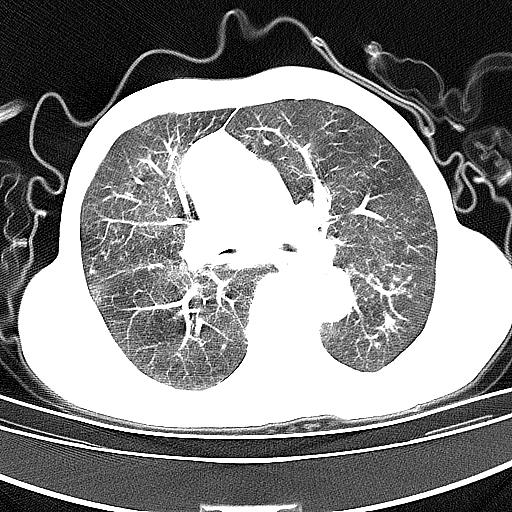
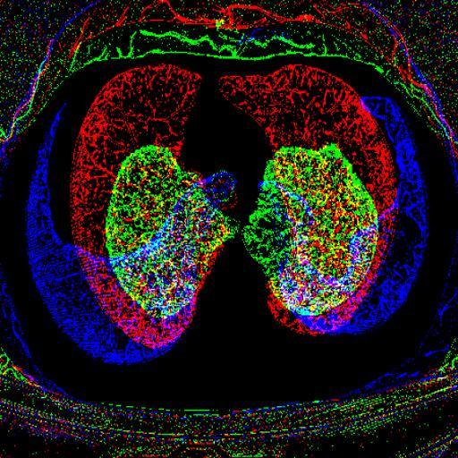

# COPD Detection Project

## 项目简介

目前临床检测慢阻肺病例多为持续气流受限，通常是进行肺功能检测，但这种检测方法不仅费时费力，而且对于早期诊断慢阻肺病例效果不佳。  

因此，本项目旨在通过深度学习模型检测和分类慢性阻塞性肺疾病（COPD）。使用了ResNet18模型进行图像分类，并结合了部分数据增强和预处理技术。
  
帮助更好的或者更快的识别病例的存在，为患者提供更好的治疗方案。


## 数据集:
来自于温州医科大学附属第一医院的慢阻肺dicom数据集，包含了正常和慢阻肺不同病患程度的共四类病例。

## 项目结果
- 项目最终训练出的模型
- 二分类时在测试集上的准确率为0.84，F1值为0.83
- 多分类在测试集上的准确率为0.63  
- F1值如图：  
- 
- 混淆矩阵：  
- 
## 安装说明:
1. 创建并激活虚拟环境：
    ```bash
    conda create -n copd-env python=3.11.8
    conda activate copd-env
    ```

2. 安装依赖项：
    ```bash
    pip install -r requirements.txt
    ```

## 使用说明

### 预处理数据：

#### 转出图片:
      项目运行数据部分总体分为Lung/Health俩个文件夹，分别存放慢阻肺和正常的dicom数据集。

#### 初步处理:
      运行`Dataset.py`将文件夹中的。Dicom文件转出为jpg格式图片  
示例：   
     
      
      并按病人分类为文件夹
      调整肺窗纵隔窗`extract_mediastinal_window`函数替换`extract_lung_window`函数
      得到调整后的肺部图片  
示例:  
     
   
      运行`cutoff.py`对图片进行裁剪和形态学处理，得到裁剪后的图片 
#### 去除干扰信息:
      运行`DeletePhoto.py`略微裁剪图片通过区域生长算法将图片中非肺部的干扰信息去除，并进行高斯去噪和膨胀腐蚀操作 得到只保留肺部图像信息的图片
      （处理完之后图片应当为只有（0.0.0）黑色像素和（255.255.255）白色像素点的灰度图片） 
      通过统计处理之后的白色像素点个数过滤相应数据量较少的图片  
如图：
   

#### 最终处理:
      运行Combin.py文件将灰度图片堆叠为三通道图片作为最终训练图片  
例：
   

## 训练模型：
1. 划分数据集：
    ```bash
    python label.py
    python Divide.py
    ```
2. 训练模型：
    ```bash
    python main.py
    ```

## 文件说明
- `net.py`：定义了ResNet18模型的结构。
- `label.py`：处理标签数据。
- `DataSet.py`：进行数据预处理，包括直方图均衡化和伽马校正。
- `cutoff.py`：裁剪图像并进行形态学处理。
- `DeletePhoto.py`：删除不符合条件的图像。
- `Divide.py`：将数据集划分为训练集、验证集和测试集。
- `Combine.py`：合并图像以生成多通道输入。
- `main.py`：主训练脚本，包含模型训练和验证逻辑。

## 依赖项
- Python 3.11.8
- PyTorch 
- torchvision 
- numpy
- pandas
- opencv-python
- pydicom
- Pillow
- matplotlib
- seaborn
- openpyxl

## 致谢
_mmastererliu_ : 感谢他在深度学习部分给予了我许多参考得以支撑我开启项目的第一步。  
_Cola_ : 感谢它在项目推进过程中给予了我许多欢乐和帮助。  
_Hongting Qian_ ：同样感谢他在项目推进过程中的许多鼓励与欢乐瞬间  

## 贡献指南
欢迎贡献代码和报告问题。请提交Pull Request或在Issues中报告问题。